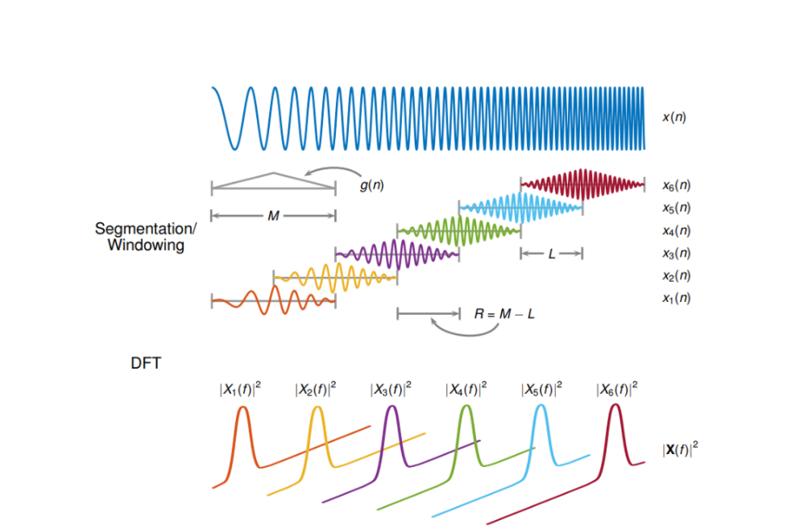
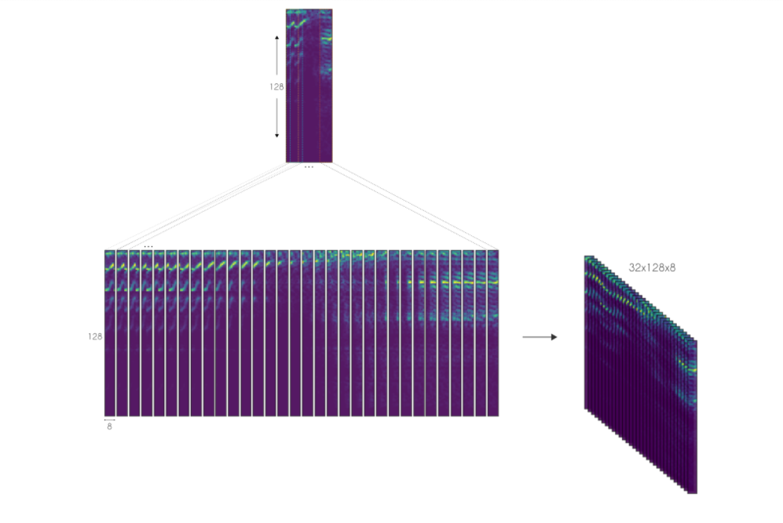
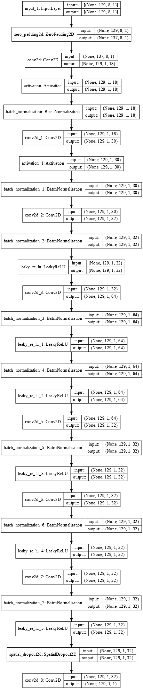

# Speech-Enhancement-

 

# Introduction
 
A lot has been said and done in the field of Image processing and denoising an image.However when it comes to noise there is still a lot of scope of improvement in this field of study.This is because unlike images which consist of a lot of information and can be augmented and used in deep learning networks the information in voice cannot be augmented like that in images and is required to go through other mechanisms to be processed.This project deals with the creation of a Deep learning Speech enhancement module to improve the noise cancellation capabilities of a speech waveform.Speech denoising is a long standing problem and the ability to denoise speech can be used in various applications such as mobile communication and edge devices.A speech denoising system has the duties to remove the background noise from a speech with minimal distortion to the original voice sample.However this requires a deep understanding of the components involved to do so and also a lot of training time and moder computation.Efforts are being made to reduce the computations by reducing number of layers in neural networks .

 
 
 
 

# Approach
 
Classic solutions for speech denoising usually employ generative modeling. Here, statistical methods like Gaussian Mixtures estimate the noise of interest and then recover the noise-removed signal. However, recent development has shown that in situations where data is available, deep learning often outperforms these solutions.

 
 

# Dataset Generation:
 
The datasets used in this project are :
1.Mozilla Common Voice dataset(for clear audio)
2.UrbanSound8k dataset
3.Daitan dataset provided by Daitan Innovation(which has a complete dataset using the above two split into training and testing sets)
 
The Mozilla Common Voice dataset is used for clean audio.the UrbanSound8k dataset consists of a large number of noise audios which can be mainly categorized into 10 different noises more or less.All these are combined to form the Daitan dataset.

To generate the dataset using the Mozilla Common Voice and Urban Sound 8k dataset use the create_dataset.py script.(By running 'python create_dataset.py' from the terminal)
 
 

# Data Preprocessing:
 
A majority of deep learning techniques nowadays dont require you to build most of the network from scratch.Take feature extractors like SIFT and SURF as an example, which are often used in Computer Vision problems like panorama stitching.Similarly for audio processing also we dont need to create the generalized data from scratch ie we let the network learn from the data.This avoids a lot of redundant work to be done on the data.We try to make the neural network learn from the data itself.
 
First, we downsampled the audio signals (from both datasets) to 8kHz and removed the silent frames from it. The goal is to reduce the amount of computation and dataset size.
 
Also an important point of difference between image denoising and audio denoising lies in the fact that audio cannot be rendered directly into images.However as for neural networks to learn they need images to work on the problem.Hence here comes 2 important types of ways to represent the audio data.An audio dataset can be represented either using the waveform method or using spectrograms.There are 2 types of spectrograms:The Mel Frequency Cepstral Coefficients(MFCCs) and the Q coefficients are the two popular spectrum methods of representation of the audio data.However for classic audio denoising MFCCs may be avoided as they remove a lot of data and are not useful for training.Also it has to be noted that there isn’t much sense in taking Fourier transform over entire signal to analyse the frequencies as audios have varying frequencies over various times.For this reason we feed the Deep Learning network with a 256 point STFT.
 
To calculate the STFT of a signal we need to define a window of length M and hop size value R.The latter defines how the window moves over the sigal.Then we slide the window over the signal and calculate the DFT of the data within the window.Thus the STFT is simply the application of the Fourier Transform over different portions of data. Lastly, we extract the magnitude vectors from the 256-point STFT vectors and take the first 129-point by removing the symmetric half. All this process was done using the Python Librosa library.
 
The image below, from MATLAB, illustrates the process.
 

  

Here, we defined the STFT window as a periodic Hamming Window with length 256 and hop size of 64. This ensures a 75% overlap between the STFT vectors. In the end, we concatenate eight consecutive noisy STFT vectors and use them as inputs. Thus, an input vector has a shape of (129,8) and is composed of the current STFT noisy vector plus seven previous noisy STFT vectors. In other words, the model is an autoregressive system that predicts the current signal based on past observations. Therefore, the targets consist of a single STFT frequency representation of shape (129,1) from the clean audio.
The image below depicts the feature vector creation.
 

  

 
 
 

# DEEP LEARNING ARCHITECTURE
 
One of the most important problems is to create a proper architecture for this project.This was decided upon that to create such a network the use of autoencoders would be very much suitable.Autoencoders are deep learning neural networks which consist of a Encoder and Decoder cascaded together.
 
For our model we based it on 2 networks:the U-Net and the CR-CED(Cascaded Redundant Convolutions Encoder-Decoder Network) Network.The model consists of multiple convolutional blocks with skip connections in between .In total the total number of trainable parameters come to around 1,69,989 with the majority being in the middle of the encoder and decoder.The encoder increases in size and the decoder decreases the size from the max position.Very much like Resnets the skip connections speed up convergence and reduces the vanishing of gradients.
 

  

One thing to note is that the convolution is performed along the frequency axis and thus the frequency axis remains constant during propagation.
 
Once the network produces an output estimate we optimize the mean squared difference(MSE) between the output and the target audio signals.
 
 
 

# RESULTS AND DISCUSSION:
 
After training this model for 100 epochs with 40 steps per cycle the results were very promising.
  
loss: 0.1689 - rmse: 0.4110
 
The output of the project looked something like
 

  

The network requires a lot of training time and computational power.With proper time and power it will provide better results.
 

  

 
 

# References:
 
1.A Fully Convolutional Neural Network for Speech Enhancement by Daitan Innovation [A Fully Convolutional Neural Network for Speech Enhancement by Daitan Innovation]
(LINK: https://github.com/daitan-innovation/cnn-audio-denoiser) 
2.Tensorflow Unet [Tensorflow Unet]
(LINK:https://github.com/jakeret/unet)  
3.Tensorflow 2.0 implementation of the paper [A Fully Convolutional Neural Network for Speech Enhancement](https://pdfs.semanticscholar.org/9ed8/e2f6c338f4e0d1ab0d8e6ab8b836ea66ae95.pdf) 
4.Blog post: [Practical Deep Learning Audio Denoising](https://medium.com/better-programming/practical-deep-learning-audio-denoising-79c1c1aea299)
